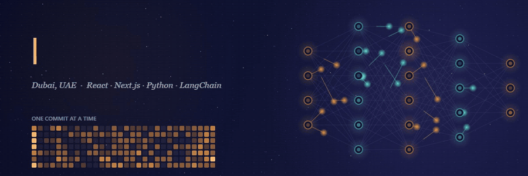

<!-- Header Banner -->

<h1 align="center">👋 Heyoooo! I'm Noah Sayed</h1>
<h3 align="center">💻 Full-Stack Developer | AI Engineer | Multi-Agent Architect</h3>

<i>"I'm gonna be the King of AI." — probably me after too much coffee ☕</i>

Rest AI Projects You can Find below 

---

<!--START_PROJECTS_LIST-->
## 🚀 Featured Projects

<em>Last updated: October 09, 2026 at 04:25 UTC</em>

<h3 style="margin: 0 0 16px 0;">
  <a href="https://github.com/NoahSayed/ai-notes" style="color: #ff6b35; text-decoration: none; font-size: 1.4em;">
    🔥 ai-notes
  </a>
</h3>

  

  AI-NOTES: a study web app with an image-to-text OCR scanner, a paragraph Q&A assistant, a memory game and a notes editor.

  
  

<a href="https://github.com/NoahSayed/ai-notes" style="display: inline-block; padding: 14px 32px; background: linear-gradient(135deg, #ff6b35 0%, #ff8c42 100%); color: white; text-decoration: none; border-radius: 10px; font-weight: 700; font-size: 16px; box-shadow: 0 6px 20px rgba(255, 107, 53, 0.4);">
  View Project →
</a>

<h3 style="margin: 0 0 16px 0;">
  <a href="https://github.com/NoahSayed/Phonemarketplace3" style="color: #ff6b35; text-decoration: none; font-size: 1.4em;">
    🔥 Phonemarketplace3
  </a>
</h3>

  

  Phone marketplace built with Next.js and TypeScript: browse by brand, buy-a-phone pages, blog and contact. Live on Vercel.

  
  

<a href="https://github.com/NoahSayed/Phonemarketplace3" style="display: inline-block; padding: 14px 32px; background: linear-gradient(135deg, #ff6b35 0%, #ff8c42 100%); color: white; text-decoration: none; border-radius: 10px; font-weight: 700; font-size: 16px; box-shadow: 0 6px 20px rgba(255, 107, 53, 0.4);">
  View Project →
</a>

<h3 style="margin: 0 0 16px 0;">
  <a href="https://github.com/NoahSayed/Ai-Trainer-web" style="color: #ff6b35; text-decoration: none; font-size: 1.4em;">
    🔥 Ai-Trainer-web
  </a>
</h3>

  

  AI workout trainer in the browser: real-time webcam pose detection counts your reps and guides you through exercise and yoga routines.

  
  

<a href="https://github.com/NoahSayed/Ai-Trainer-web" style="display: inline-block; padding: 14px 32px; background: linear-gradient(135deg, #ff6b35 0%, #ff8c42 100%); color: white; text-decoration: none; border-radius: 10px; font-weight: 700; font-size: 16px; box-shadow: 0 6px 20px rgba(255, 107, 53, 0.4);">
  View Project →
</a>

<!--END_PROJECTS_LIST-->

---

## 📂 All Projects

<i>Everything else I've built, from first websites to full-stack apps — 20 repositories and counting.</i>

<table>
<tr>
<td width="50%" align="center" valign="top">

 <a href="https://github.com/NoahSayed/musicplayer"><b>musicplayer</b></a>
</td>
<td width="50%" align="center" valign="top">

 <a href="https://github.com/NoahSayed/amazon-clone-for-client"><b>amazon-clone-for-client</b></a>
</td>
</tr>
<tr>
<td width="50%" align="center" valign="top">

 <a href="https://github.com/NoahSayed/toolmart"><b>toolmart</b></a>
</td>
<td width="50%" align="center" valign="top">

 <a href="https://github.com/NoahSayed/noahip"><b>noahip</b></a>
</td>
</tr>
<tr>
<td width="50%" align="center" valign="top">

 <a href="https://github.com/NoahSayed/IP-LOCATOR"><b>IP-LOCATOR</b></a>
</td>
<td width="50%" align="center" valign="top">

 <a href="https://github.com/NoahSayed/IpLocator"><b>IpLocator</b></a>
</td>
</tr>
<tr>
<td width="50%" align="center" valign="top">

 <a href="https://github.com/NoahSayed/phplocation"><b>phplocation</b></a>
</td>
<td width="50%" align="center" valign="top">

 <a href="https://github.com/NoahSayed/lazertechnology"><b>lazertechnology</b></a>
</td>
</tr>
<tr>
<td width="50%" align="center" valign="top">

 <a href="https://github.com/NoahSayed/php-tourr-toravel"><b>php-tourr-toravel</b></a>
</td>
<td width="50%" align="center" valign="top">

 <a href="https://github.com/NoahSayed/quiz-app"><b>quiz-app</b></a>
</td>
</tr>
<tr>
<td width="50%" align="center" valign="top">

 <a href="https://github.com/NoahSayed/particle-JS-Dice"><b>particle-JS-Dice</b></a>
</td>
<td width="50%" align="center" valign="top">

 <a href="https://github.com/NoahSayed/Positioning"><b>Positioning</b></a>
</td>
</tr>
<tr>
<td width="50%" align="center" valign="top">

 <a href="https://github.com/NoahSayed/HotelDesign"><b>HotelDesign</b></a>
</td>
<td width="50%" align="center" valign="top">

 <a href="https://github.com/NoahSayed/NotesApp"><b>NotesApp</b></a>
</td>
</tr>
<tr>
<td width="50%" align="center" valign="top">

 <a href="https://github.com/NoahSayed/JavaSQuiz"><b>JavaSQuiz</b></a>
</td>
<td width="50%" align="center" valign="top">

 <a href="https://github.com/NoahSayed/timesite"><b>timesite</b></a>
</td>
</tr>
<tr>
<td width="50%" align="center" valign="top">

 <a href="https://github.com/NoahSayed/AInotes-react"><b>AInotes-react</b></a>
</td>
<td width="50%" align="center" valign="top">

 <a href="https://github.com/NoahSayed/cookingnew"><b>cookingnew</b></a>
</td>
</tr>
<tr>
<td width="50%" align="center" valign="top">

 <a href="https://github.com/NoahSayed/Gui-based-game-"><b>Gui-based-game-</b></a>
</td>
<td width="50%" align="center" valign="top">

 <a href="https://github.com/NoahSayed/irst-Website-On-Github-5-years-ago"><b>irst-Website-On-Github-5-years-ago</b></a>
</td>
</tr>
</table>

---

## 🧠 Snapshot — TL;DR (Resume distilled)
**Noah Sayed** — `noahsayed44@gmail.com` · [GitHub/NoahSayed](https://github.com/NoahSayed)

**Summary**  
Full-Stack AI Engineer based in Dubai, UAE. I build React / Next.js web apps and bring AI into them — from LangChain-powered chat and agents to computer-vision projects like webcam pose detection and image classification.

---

## 💼 Experience (highlights)
**Full Stack AI Engineer — Contreat** (Dubai) — 09/2024 – Present  
- Building and shipping full-stack web products, including the [Contreat Consulting website](https://contreat-consulting.vercel.app) (React, SCSS, Vercel).

---

## 🎓 Education
- **Bachelor's Degree**

---

## 🧰 Skills
**Languages:** JavaScript, TypeScript, Python, Java, PHP  
**Frontend:** React.js, Next.js, Vite, Tailwind, SCSS  
**Backend:** Node.js, Express, REST APIs  
**ML/AI:** LangChain.js, TensorFlow, OpenCV, pose estimation, OCR  
**Infra & Tools:** Git, GitHub Actions, Vercel, Netlify

---

## 📫 Reach Me
- **Email:** noahsayed44@gmail.com  
- **GitHub:** https://github.com/NoahSayed  
- **Location:** Dubai, UAE

---

  
### 🤖 This README auto-updates daily with my latest projects
  
_Powered by GitHub Actions • Last updated: Auto-magic ✨_

